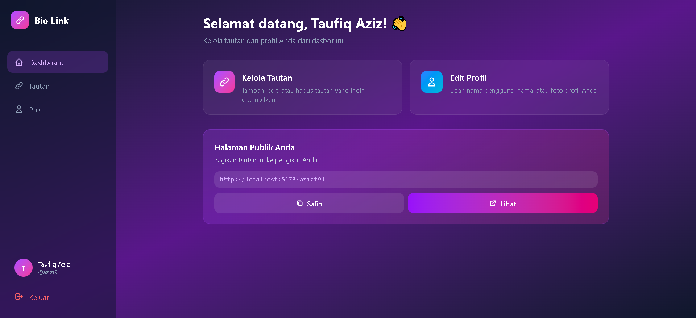
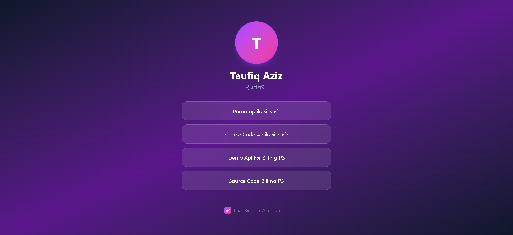

# 🔗 Bio Link - Aplikasi Link in Bio Modern

<p align="center">
  
  
  
  
</p>

Aplikasi **Bio Link** modern dengan tampilan premium untuk membagikan semua link penting Anda dalam satu halaman. Cocok untuk content creator, influencer, bisnis, dan personal branding.

---

## ✨ Fitur Utama

- 🎨 **Desain Modern & Premium** - UI glassmorphism dengan gradient warna yang menarik
- 📱 **Fully Responsive** - Tampilan optimal di desktop dan mobile
- 🔐 **Autentikasi Lengkap** - Register, Login, Logout dengan Supabase Auth
- 🔗 **Kelola Tautan** - Tambah, edit, hapus, dan atur urutan tautan
- 👁️ **Toggle Visibility** - Aktifkan/nonaktifkan tautan tanpa menghapus
- 📋 **Copy Link** - Salin URL halaman publik dengan satu klik
- 🌐 **Halaman Publik** - Setiap user mendapat URL unik (`domain.com/username`)
- 🇮🇩 **Full Bahasa Indonesia** - Antarmuka dalam Bahasa Indonesia

---

## 🖼️ Screenshot

| Dashboard | Halaman Publik |
|-----------|----------------|
|  |  |

---

## 🛠️ Tech Stack

| Teknologi | Deskripsi |
|-----------|-----------|
| **React 19** | Library UI modern dengan hooks |
| **Vite** | Build tool super cepat |
| **Tailwind CSS 4** | Utility-first CSS framework |
| **Supabase** | Backend-as-a-Service (Auth + Database) |
| **React Router 7** | Client-side routing |

---

## 📦 Instalasi

### Prasyarat
- Node.js 18+ terinstall
- Akun [Supabase](https://supabase.com) (gratis)

### Langkah 1: Clone Repository

```bash
git clone https://github.com/azizt91/biolink.git
cd bio-link-app
```

### Langkah 2: Install Dependencies

```bash
npm install
```

### Langkah 3: Setup Supabase

1. Buat project baru di [Supabase Dashboard](https://app.supabase.com)
2. Buka **SQL Editor** dan jalankan query dari file `supabase_schema.sql`
3. Copy **Project URL** dan **anon/public key** dari Settings > API

### Langkah 4: Konfigurasi Environment

Buat file `.env` di root folder:

```env
VITE_SUPABASE_URL=https://your-project.supabase.co
VITE_SUPABASE_ANON_KEY=your-anon-key
```

### Langkah 5: Jalankan Aplikasi

```bash
npm run dev
```

Buka browser dan akses `http://localhost:5173`

---

## 🗄️ Struktur Database

Aplikasi menggunakan 2 tabel utama di Supabase:

### Tabel `profiles`
| Kolom | Tipe | Deskripsi |
|-------|------|-----------|
| id | UUID | Primary key (dari auth.users) |
| username | TEXT | Username unik |
| full_name | TEXT | Nama lengkap |
| avatar_url | TEXT | URL foto profil |

### Tabel `links`
| Kolom | Tipe | Deskripsi |
|-------|------|-----------|
| id | UUID | Primary key |
| user_id | UUID | Foreign key ke profiles |
| title | TEXT | Judul tautan |
| url | TEXT | URL tujuan |
| sort_order | INTEGER | Urutan tampil |
| is_active | BOOLEAN | Status aktif |

---

## 📁 Struktur Folder

```
bio-link-app/
├── public/           # Asset statis
├── src/
│   ├── components/   # Komponen reusable
│   ├── contexts/     # React Context (Auth)
│   ├── lib/          # Konfigurasi (Supabase)
│   ├── pages/        # Halaman aplikasi
│   │   ├── Dashboard.jsx
│   │   ├── DashboardHome.jsx
│   │   ├── LinksManage.jsx
│   │   ├── ProfileEdit.jsx
│   │   ├── PublicProfile.jsx
│   │   ├── Login.jsx
│   │   └── Register.jsx
│   ├── router/       # Konfigurasi routing
│   ├── App.jsx
│   ├── main.jsx
│   └── index.css
├── .env              # Environment variables
├── supabase_schema.sql
└── package.json
```

---

## 🚀 Deployment

### Deploy ke Netlify (Rekomendasi)

1. Push code ke GitHub
2. Login ke [Netlify](https://netlify.com)
3. Klik **"Add new site"** > **"Import an existing project"**
4. Pilih repository dari GitHub
5. Konfigurasi build:
   - **Build command:** `npm run build`
   - **Publish directory:** `dist`
6. Tambahkan Environment Variables di Site Settings
7. Deploy!

### Deploy ke Vercel

```bash
npm install -g vercel
vercel
```

---

## 🔧 Kustomisasi

### Mengubah Warna Tema

Edit file `src/index.css` dan ubah gradient di komponen:

```css
/* Contoh: Ubah primary gradient */
.bg-gradient-to-r from-purple-600 to-pink-600
/* Menjadi */
.bg-gradient-to-r from-blue-600 to-cyan-600
```

### Menambah Field Profil

1. Tambah kolom baru di tabel `profiles` via Supabase
2. Update `ProfileEdit.jsx` untuk form input
3. Update `PublicProfile.jsx` untuk tampilan

---

## 📄 Lisensi

Source code ini dilisensikan untuk penggunaan personal dan komersial setelah pembelian. Dilarang menjual ulang atau mendistribusikan kembali tanpa izin.

---

## 💬 Dukungan

Butuh bantuan atau kustomisasi? Hubungi:
- 📧 Email: [azizt91@gmail.com]
- 💬 WhatsApp: [+6281914170701]

---

<p align="center">
  Made with ❤️ by <strong>azizt91</strong>
</p>
